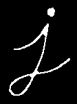

TODO: Put a short description of the package here that helps potential users
know whether this package might be useful for them.

## Features

TODO:

- [ ] Image Reading and Writing:
  - [X] Read image: `imread()`
  - [X] Write image: `imwrite()`

- [ ] Image Properties:
  - [X] Get image size: `size()`
  - [ ] Determine image type: `type()`
  - [ ] Access and modify pixel values on the image: `at()`, `set()`

- [ ] Morphological Operation:
  - [X] Eroding 
  - [X] Dilate 

- [ ] Color Conversions:
  - [X] Convert color spaces: `cvtColor()` for grayscale
  - [ ] Define constants for color space conversions: `COLOR_*`

- [ ] Filtering and Edge Detection:
  - [X] Gaussian blur: `GaussianBlur()`
  - [X] Average blur: `Average()`
  - [X] Bileteral blur: `Bileteral()`
  - [X] Average blur: `Average()`
  - [X] Median blur: `medianBlur()`

- [ ] Edge Detection:
  - [X] Edge detection: `Canny()`
  - [X]  Laplace: `Laplace()`
  - [X]  Sobel: `Sobel()`

- [ ] Geometric Transformations:
  - [ ] Perspective transformation: `warpPerspective()`
  - [X] Scaling: `resize()`
  - [X] Rotation: `rotate()`

- [ ] Template Matching:
  - [ ] Template matching operation: `matchTemplate()`

- [ ] Contour Detection:
  - [ ] Contour detection: `findContours()`
  - [ ] Compute contour properties: `contourArea()`, `arcLength()`, `boundingRect()`

- [ ] Object Detection:
  - [ ] Face detection: `CascadeClassifier()`
  - [ ] Object detection: `detectMultiScale()`

- [ ] Computational Operations:
  - [ ] Mathematical operations: `add()`, `subtract()`, `multiply()`, `divide()`
  - [ ] Histogram calculation: `calcHist()`

- [ ] Image Processing Helpers:
  - [ ] Bitwise masking operations: `bitwise_and()`, `bitwise_or()`, `bitwise_not()`
  - [ ] Splitting and merging images: `split()`, `merge()`
  - [ ] Defining Regions of Interest (ROI): `Rect()`

- [ ] Graphical User Interface (GUI) Helpers:
  - [ ] Display image on the screen: `imshow()`
  - [ ] Detect keyboard or mouse interactions: `waitKey()`


## Usage

TODO: Include short and useful examples for package users. Add longer examples
to `/example` folder. 

```dart
const like = 'sample';
```

## Additional information

TODO: Tell users more about the package: where to find more information, how to 
contribute to the package, how to file issues, what response they can expect 
from the package authors, and more.
